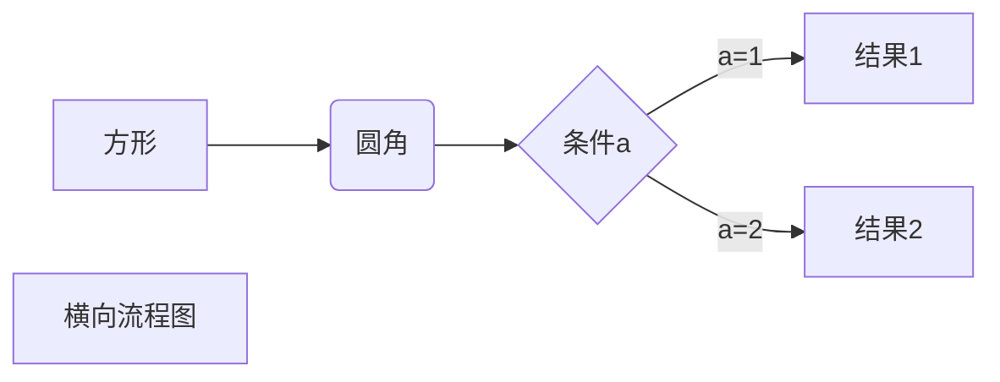

# 高级技巧


不在 Markdown 涵盖范围之内的标签，都可以直接在文档里面用 HTML 撰写。

目前支持的 HTML 元素有：`<kbd>`、`<b>`、`<i>`、`<em>`、`<sup>`、`<sub>`等 

如：
```
使用 <kbd>Win</kbd>+<kbd>Shift</kbd>+<kbd>S</kbd> 截图

x<sup>2</sup>+x+1=0
```
效果：

使用 <kbd>Win</kbd>+<kbd>Shift</kbd>+<kbd>S</kbd> 截图

x<sup>2</sup>+x+1=0


## mermaid

## stl
```stl
solid cube_corner
  facet normal 0.0 -1.0 0.0
    outer loop
      vertex 0.0 0.0 0.0
      vertex 1.0 0.0 0.0
      vertex 0.0 0.0 1.0
    endloop
  endfacet
  facet normal 0.0 0.0 -1.0
    outer loop
      vertex 0.0 0.0 0.0
      vertex 0.0 1.0 0.0
      vertex 1.0 0.0 0.0
    endloop
  endfacet
  facet normal -1.0 0.0 0.0
    outer loop
      vertex 0.0 0.0 0.0
      vertex 0.0 0.0 1.0
      vertex 0.0 1.0 0.0
    endloop
  endfacet
  facet normal 0.577 0.577 0.577
    outer loop
      vertex 1.0 0.0 0.0
      vertex 0.0 1.0 0.0
      vertex 0.0 0.0 1.0
    endloop
  endfacet
endsolid
```
